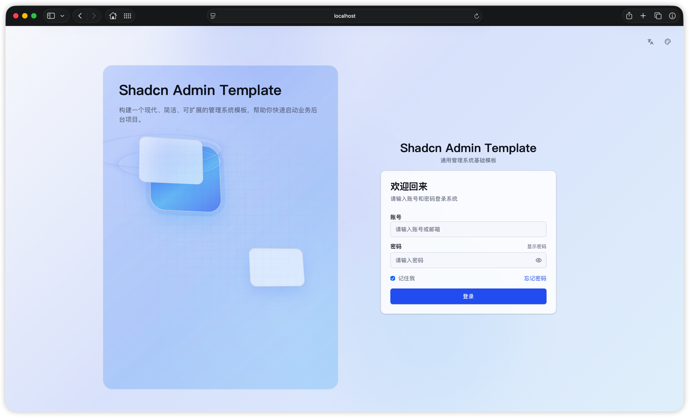
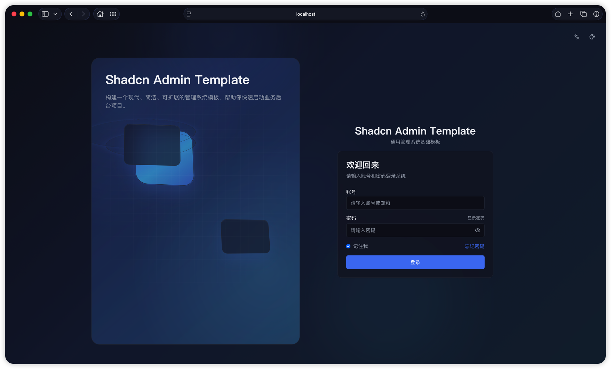
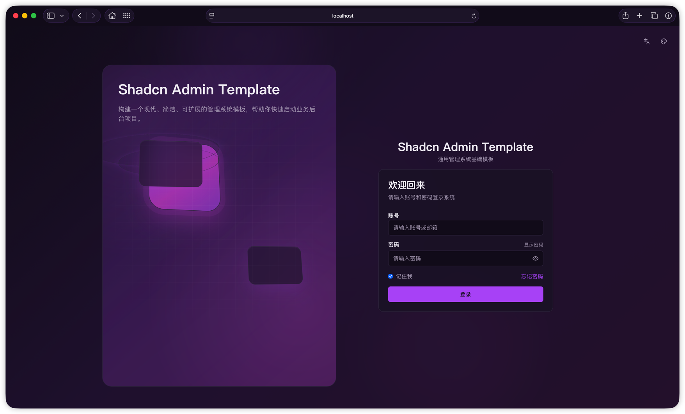
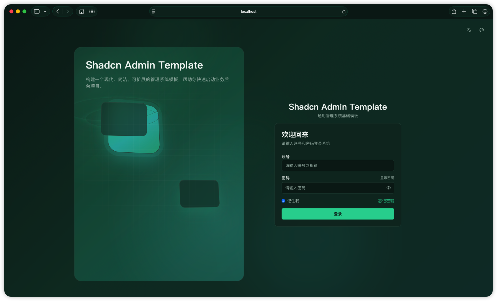
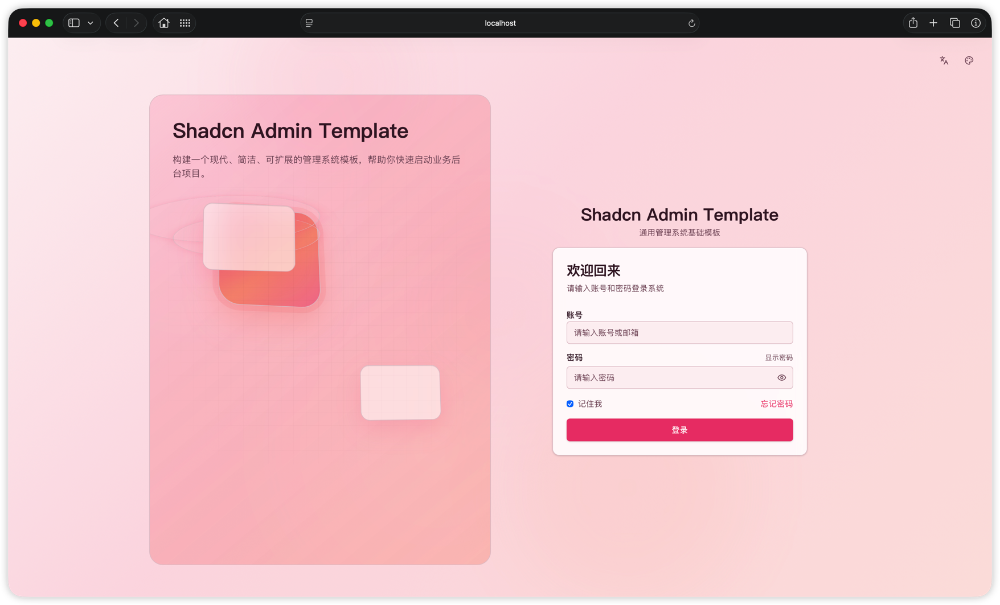
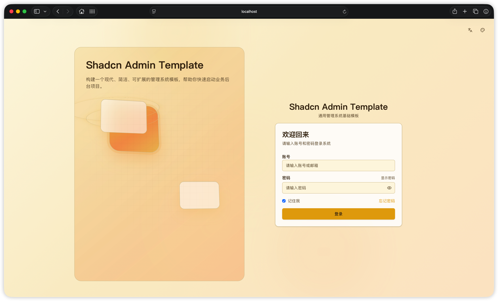
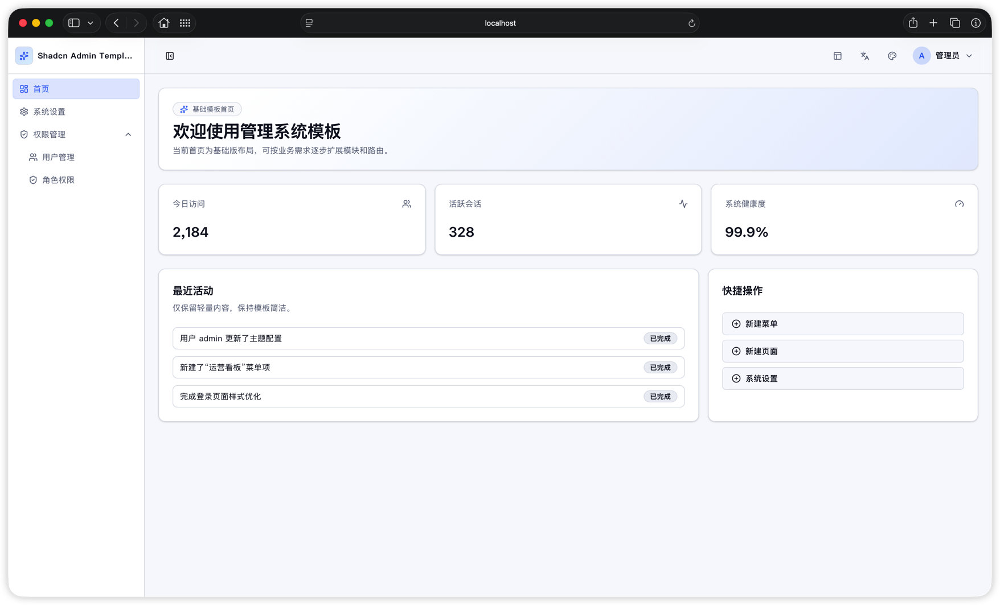
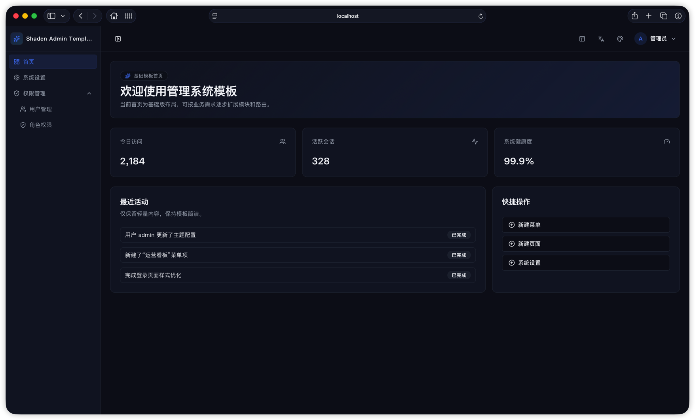

# shadcn-admin-template

> **定位说明（请务必先看）**  
> 本仓库是 **通用基础模板（Starter）**，不是某一行业的成品后台。  
> 刻意保持 **轻量、无业务冗余**：不包含真实业务模块、复杂报表、权限引擎实现等「多余内容」，只保留搭建管理系统时几乎都会用到的 **壳层与工程化能力**。  
> 你可以把它当作 **任意中后台 / 管理系统的起始工程**，在此之上按需增删页面、接入真实接口与业务即可。

---

一个基于 **React + TypeScript + Vite + TailwindCSS v4 + shadcn/ui** 的后台管理起始模板，开箱即用。

当前仅内置 **搭建后台所必需的最小能力集**（可按项目需要继续扩展或删减）：

- 仪表盘布局（多种布局模式可选：侧栏 / 顶栏 / 混合等）
- 动态页面路由注册（通过页面元信息自动生成路由与菜单）
- 多主题切换（亮色、暗色及多套自定义主题）
- 多语言切换（中文 / 英文）
- 基础 UI 组件封装（Button、Card、Input、Label、Badge 等）

## 界面预览

以下为仓库 `public/` 目录中的界面截图示例（登录页、首页）。

### 登录页

|  |  |
| --- | --- |
|  |  |
|  |  |
|  |  |

### 首页

|  |  |
| --- | --- |
|  |  |

## 技术栈

- React 19
- TypeScript 6
- Vite 8
- React Router 7
- TailwindCSS 4
- shadcn/ui（基于 `components.json` 配置）
- `next-themes`（主题持久化与切换）
- Lucide React（图标）

## 快速开始

### 1) 安装依赖

```bash
npm install
```

### 2) 启动开发环境

```bash
npm run dev
```

默认启动后可在浏览器访问 Vite 提示的本地地址（通常是 `http://localhost:5173`）。

### 3) 生产构建与预览

```bash
npm run build
npm run preview
```

### 4) 代码检查

```bash
npm run lint
```

## 可用脚本


| 脚本                | 说明                     |
| ----------------- | ---------------------- |
| `npm run dev`     | 启动本地开发服务               |
| `npm run build`   | TypeScript 构建检查并打包生产资源 |
| `npm run preview` | 本地预览生产构建结果             |
| `npm run lint`    | 使用 ESLint 检查代码规范       |


## 目录结构

```txt
.
├─ public/
├─ src/
│  ├─ components/        # 布局、切换器、用户菜单、基础 UI 组件
│  ├─ config/            # 路由配置生成逻辑
│  ├─ context/           # 全局上下文（如语言）
│  ├─ hooks/             # 自定义 hooks
│  ├─ i18n/              # 多语言文案与映射
│  ├─ lib/               # 工具函数
│  ├─ pages/             # 页面模块（*-page.tsx）
│  ├─ types/             # 类型定义
│  ├─ app-router.tsx     # 路由入口
│  ├─ App.tsx            # 应用根组件（Provider 组合）
│  └─ main.tsx           # 应用挂载入口
├─ components.json       # shadcn/ui 配置
├─ eslint.config.js
├─ vite.config.ts
└─ README.md
```

## 路由与菜单约定

本项目通过 `src/config/routes.tsx` 自动收集 `src/pages/*-page.tsx` 页面模块，并读取页面组件上的 `routeMeta` 信息来生成路由。

这意味着你新增页面时，可以遵循以下方式：

1. 在 `src/pages` 下新增 `xxx-page.tsx` 文件。
2. 在页面组件上声明 `routeMeta`（路径、标题、布局、菜单显示、排序、图标等）。
3. 路由与侧边菜单会按约定自动接入。

## 主题与国际化

- **主题**：在 `src/App.tsx` 中通过 `ThemeProvider` 配置可用主题集合，主题值会持久化到本地存储。
- **国际化**：在 `src/i18n/locales` 下维护语言包，`src/components/locale-provider.tsx` 负责语言状态管理和持久化。

## 如何新增一个管理页面

建议流程：

1. 在 `src/pages` 新建 `xxx-page.tsx`。
2. 使用 `Card`、`Button`、`Input` 等基础组件搭建页面结构。
3. 补充页面 `routeMeta`，决定其是否进入菜单、使用哪种布局、显示顺序等。
4. 在 `src/i18n/locales/zh-CN.ts` 与 `src/i18n/locales/en-US.ts` 增加对应文案键值。
5. 本地运行 `npm run lint` 与 `npm run build` 做基础校验。

## 开发建议

- 本模板刻意保持精简：二开时建议 **先加业务、后抽象**，避免把模板本身堆成「小产品」。
- 新增通用组件优先放在 `src/components/ui` 或 `src/components`。
- 页面级业务逻辑优先放在页面文件附近，避免过早抽象。
- 多语言文案统一通过 i18n key 管理，避免在页面中硬编码文本。
- 主题色建议使用 CSS 变量和 Tailwind 原子类组合，保持风格一致。

## API 与 Mock（登录/退出示例）

项目已提供基础 API 管理与 mock 示例，目录如下：

- `src/api/request.ts`：统一请求入口（基础 URL、统一响应、错误处理、mock 分发）
- `src/api/modules/auth.ts`：登录/退出接口封装与 token 管理示例
- `src/api/mock/auth.ts`：登录/退出 mock 处理器

默认在开发环境启用 mock。你也可以通过环境变量控制：

- `VITE_API_USE_MOCK=true`：强制启用 mock
- `VITE_API_USE_MOCK=false`：关闭 mock，走真实后端接口
- `VITE_API_BASE_URL=https://your-api-host.com`：设置后端服务地址

登录 mock 账号示例：

- 账号：`admin`
- 密码：`123456`

